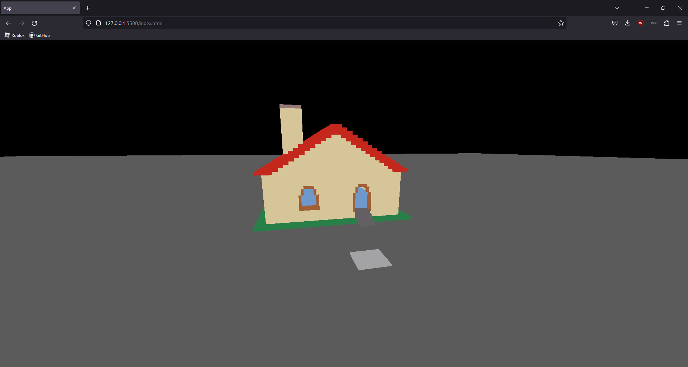

# Roblox To Three.js

This works by serializing the map into a compact JSON format which is then turned into 3D objects by three.js\
In the end, this allows the Roblox map to be viewed in the browser.

Note: you must activate cors-anywhere (simply click the button) through https://cors-anywhere.herokuapp.com/ to be able to test this.

Does not have support for:\
Meshes\
Unions\
Decals\
Textures

Video demonstration: https://streamable.com/hmxgli

